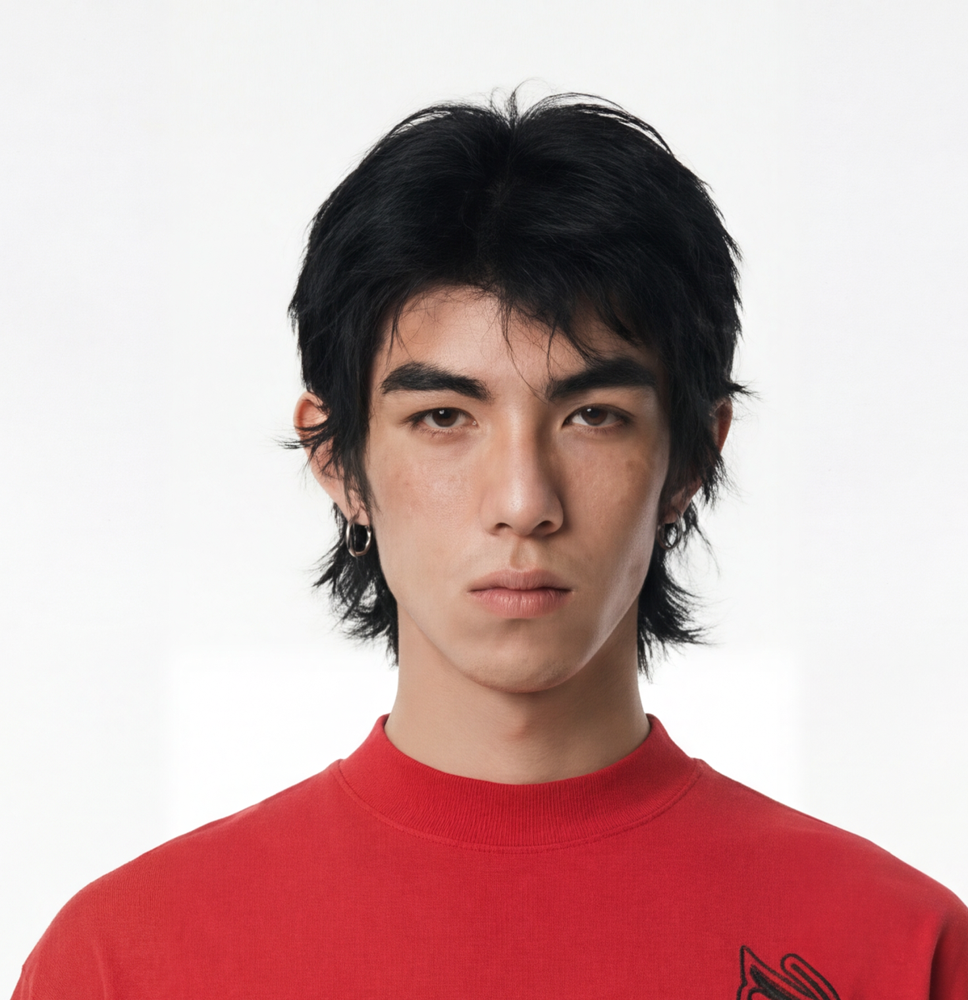

# lianbu

`lianbu` 是一个 Codex skill，用于把模特全身图或半身图中的脸部先提取出来，再生成同一人物的脸部三视图，最后把三视图重绘成高质量彩铅手绘风格。

核心思路参考“彩铅 + 多视图法”：先用三视图建立同一人物的正面、四分之三侧面、侧面结构，再用彩铅风格弱化照片皮肤质感，同时把五官结构补清楚，最终得到适合作为后续生图参考的脸部角色设定图。

## 适用场景

- 输入一张模特全身图，希望提取脸部并制作三视图。
- 输入一张上半身人物图，希望生成正面、45 度、侧面的人脸参考图。
- 希望把真人照片感转成温暖、清晰、可辨识的彩铅手绘风格。
- 希望保留人物身份特征，但减少照片皮肤质感，让图片更适合作为后续 AI 生图参考。

## 图片示例

下面这张图片可以作为 `lianbu` 的示例输入图。它已经是清晰的正面脸部图，适合测试“脸部身份参考 -> 三视图 -> 彩铅重绘”的完整流程。



示例调用：

```text
使用 $lianbu，把这张示例模特图生成正面、四分之三侧面、侧面三视图，然后重绘成高质量彩铅手绘风格。
```

预期处理结果：

- 三个视角保持同一人物特征。
- 黑色发型、脸型、眉眼比例和整体气质尽量一致。
- 背景保持白色或接近白色。
- 输出呈现彩铅手绘质感，五官结构清晰可辨。

## 工作流程

### Step 1: 准备原图

准备一张清晰的人物全身图或半身图。人物脸部越清楚，三视图的一致性越好。

建议输入图片满足：

- 单人主体明确。
- 脸部没有严重遮挡。
- 头发、脸型、五官和耳朵轮廓尽量可见。
- 图片分辨率不要太低。

如果原图脸部已经模糊，skill 仍然可以运行，但五官细节会由模型保守推断，最终结果更适合做风格与流程测试，不适合做强身份一致性参考。

### Step 2: 截取脸部

Codex 会先从原图中截取脸部区域，保留：

- 头顶和发际线
- 脸型
- 眼睛、鼻子、嘴巴
- 下巴
- 可见耳朵
- 少量脸部周围留白

这一步是关键，因为脸部裁切图会作为后续三视图生成的身份锚点。不要直接从全身图生成彩铅图，否则人物脸部信息容易丢失。

### Step 3: 生成脸部三视图

使用脸部裁切图作为身份参考，生成同一人物的三张脸部视角：

- 正面
- 四分之三侧面
- 侧面

三视图需要保持同一人物特征一致，包括脸型、发型、眼鼻嘴比例、肤色和整体年龄气质。背景使用白色，构图保持干净，重点只放在头部和颈部。

### Step 4: 彩铅风格重绘

对三视图进行局部风格重绘，把脸部转换成彩铅手绘效果。默认提示词为：

```text
将图像中人物脸部转换为高质量彩铅手绘风格，脸部保持手绘感但五官结构准确可辨，整体温暖艺术氛围，白色背景，清晰高分辨率。
```

必要时可追加约束：

```text
保持三视图构图不变，保持同一人物身份特征一致，避免照片质感、油画质感、漫画夸张变形和复杂背景。
```

核心目标是：上传的是彩铅图，让模型后续更容易输出真人质感画面；彩铅图是骨架，最终出图不应被彩铅风格锁死。

### Step 5: 结果检查

完成后检查：

- 是否包含正面、四分之三侧面、侧面三个视角。
- 三个视角是否像同一个人。
- 五官结构是否清晰可辨。
- 背景是否为白色或接近白色。
- 画面是否为彩铅手绘质感，而不是照片滤镜、油画或夸张漫画。
- 是否没有多余饰品、水印、复杂背景或额外人物。

## 安装方式

把本仓库文件夹复制到 Codex skills 目录中：

```powershell
Copy-Item -Recurse . "$env:USERPROFILE\.codex\skills\lianbu"
```

如果你设置了 `CODEX_HOME`，可以复制到：

```powershell
Copy-Item -Recurse . "$env:CODEX_HOME\skills\lianbu"
```

复制后，在 Codex 中用 `$lianbu` 调用。

## 使用示例

上传一张模特图片后，可以这样说：

```text
使用 $lianbu，把这张模特图的脸部截取出来，生成正面、四分之三侧面、侧面三视图，然后重绘成彩铅手绘风格。
```

也可以更短：

```text
用 $lianbu 处理这张图。
```

## 默认生成提示词

三视图生成阶段：

```text
Using the provided cropped face as the identity reference, create a clean face reference sheet with three views of the same person: front view, three-quarter view, and side profile view. Preserve the person's recognizable facial proportions, hairstyle, face shape, eyes, nose, mouth, and overall identity. Show only the head and neck area. Use a white background, clear lighting, high resolution, and a neat character reference layout. Do not add accessories or change the person's age, gender presentation, ethnicity, or expression beyond a neutral natural expression.
```

彩铅重绘阶段：

```text
将图像中人物脸部转换为高质量彩铅手绘风格，脸部保持手绘感但五官结构准确可辨，整体温暖艺术氛围，白色背景，清晰高分辨率。
```

## 注意事项

- 这个 skill 是工作流说明，不自带独立生图模型；实际生成依赖 Codex 当前可用的图像生成或图像编辑工具。
- 输入图越清晰，三视图身份一致性越好。
- 如果原图脸部模糊、遮挡严重或角度极端，结果可能只能作为参考草图。
- 不要把这个流程用于身份识别、真人身份验证或规避隐私保护。
- 公开仓库中不要提交用户的真人原图、临时生成图或隐私素材。
